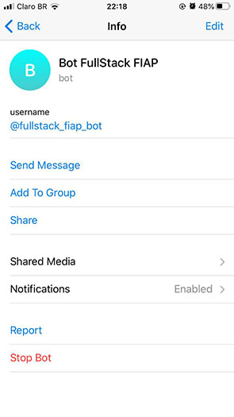

# Projeto chatbot no telegram com Java SE e Botfather


##  Pré-requisitos para execução do Bot
 - Tecnologias necessárias.
 
    1- Para executar o projeto é necessário ter o JRE 8 ou JDK 8 instalado.
 
    2- Utilizar uma IDE para execução. (Eclipse é recomendado)
 
 - Dados do Bot

 


## Instalação


`git clone https://github.com/camisbressan/fiap-telegram-bot.git`


## Executando o projeto

No diretório **src** no pacote **br.com.fiap.telegram.aplicacao** existe um arquivo chamado **App.java** . Abra esse arquivo e execute **Run**


##  Utilizando um bot novo(opcional)

 
Esse bot será o responsável por enviar notificações ao seu ambiente e para o desenvolvimento do Bot, é necessário solicitar um token para o 
[@BotFather](https://telegram.me/BotFather), um bot do próprio Telegram para criação e gestão dos Bots. 

Como todas as requisições serão feitas por uma conexão HTTP, é necessário ter uma chave de acesso privada para o seu bot, para isso, inicie uma conversa com o `BotFather` e digite `/newbot` ele irá te perguntar o nome do seu bot e gerar uma chave de acesso no final, guarde ela, usaremos mais adiante.

Após criar um novo bot digite `/getChatId` para descobrir o token ID do bot criado.


Para enviar notificações, simplesmente chamamos  `TelegramBotNotifier.notify.sendMessage(MESSAGE, HTTP_API_TOKEN, ChatId) `, passando a mensagem, o token da API HTTP do BotFather e o ID do bate-papo da etapa anterior. 
```
TelegramBotNotifier.notify.sendMessage('Hello world !', TelegramConfig.BOT_TOKEN, TelegramConfig.CHAT_ID);
```

Ou se preferir inclua o token gerado no arquivo **App.java** 

`TelegramBot bot = TelegramBotAdapter.build("612318242:AAExbdLeFKWFkkCfOR5kK3II8nmPV5Q-mhg");`


## Telegram Documentação oficial

[https://core.telegram.org/bots](https://core.telegram.org/bots)
  	
[https://core.telegram.org/bots/api](https://core.telegram.org/bots/api)

 
